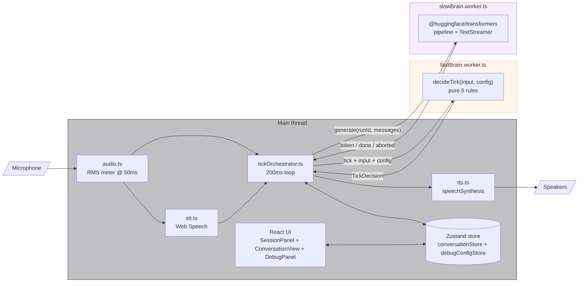
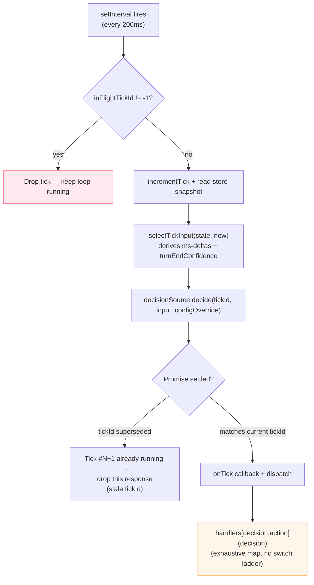
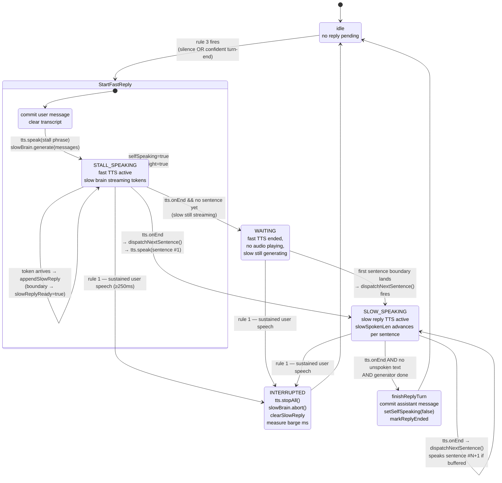
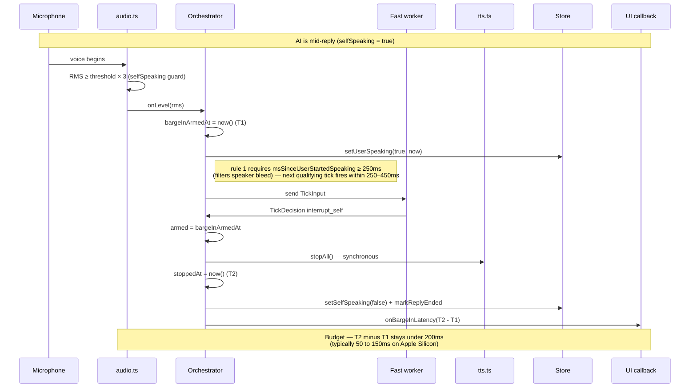
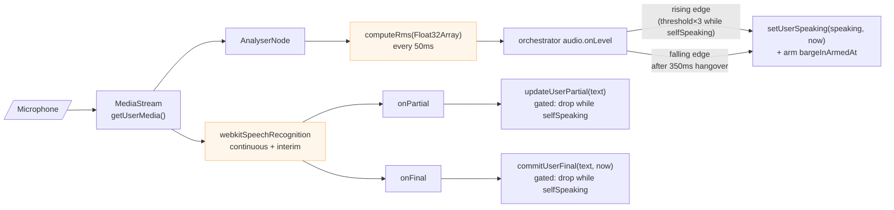
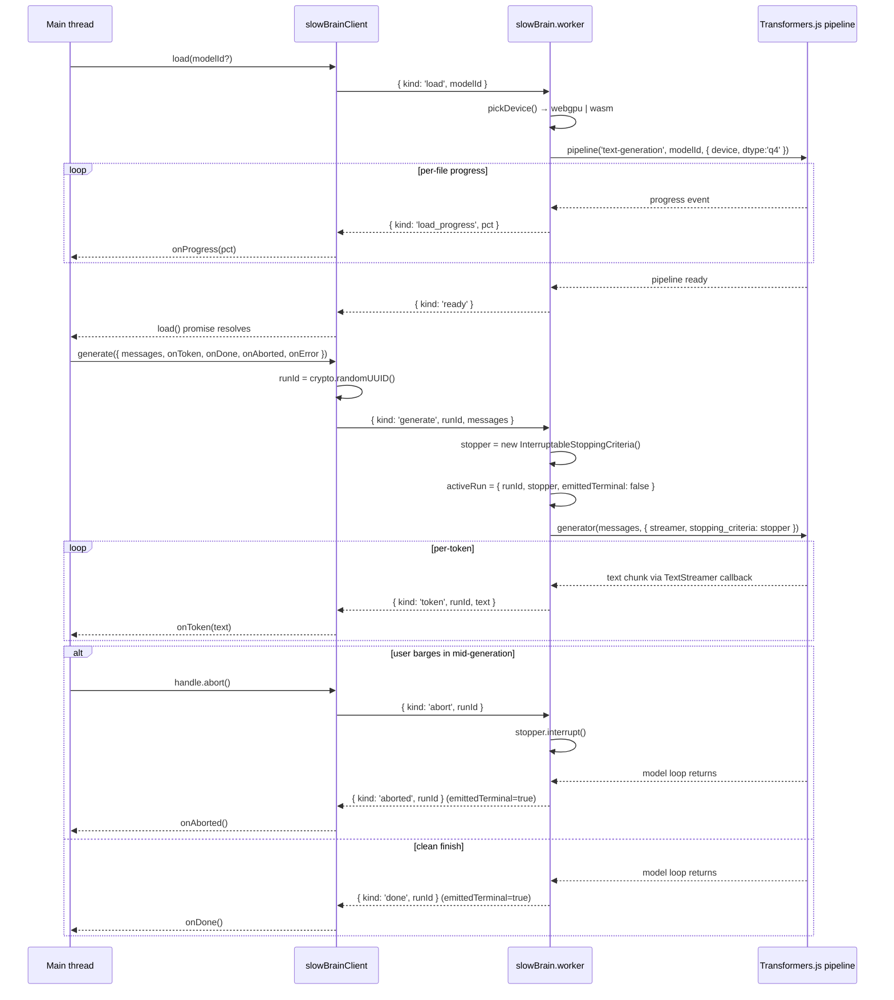
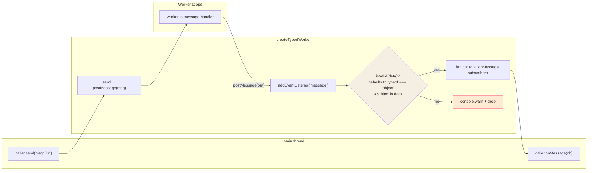
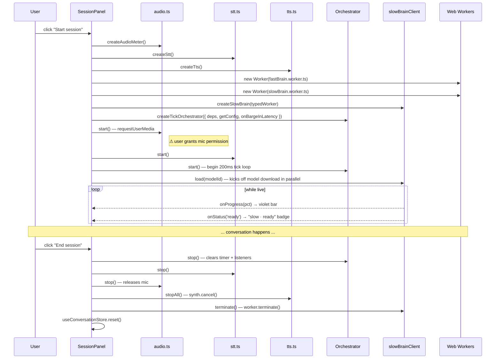

# Flowcharts

Mermaid diagrams of every flow in DuetMind. GitHub renders Mermaid
inline; local viewers usually do too.

For _what_ each file does, see [`STRUCTURE.md`](./STRUCTURE.md).

---

## 1. Architecture overview

Top-level threads + the store that binds them.

---

## 2. The 200ms tick loop

What happens every 200ms inside the orchestrator.

---

## 3. Decision rule evaluation

Top-down. First matching rule wins.

```mermaid
flowchart TD
  In([TickInput + DecisionConfig])

  R1{"Rule 1 — barge-in<br/>userSpeaking AND selfSpeaking<br/>AND speech sustained 250ms+<br/>AND bargeInEnabled?"}
  R2{"Rule 2 — backchannel<br/>userSpeaking AND speech over 1.5s<br/>AND cooldown OK AND random under 0.5<br/>AND backchannelEnabled?"}
  R4{"Rule 4 — handoff<br/>selfSpeaking && slowReplyReady<br/>&& replyInFlight?"}
  R3{"Rule 3 — start reply<br/>not speaking AND no replyInFlight<br/>AND transcript non-empty AND<br/>silence over 700ms OR (silence over 300ms<br/>AND confidence at or above 0.7)?"}
  R5{Else}

  A1[["interrupt_self"]]
  A2[["backchannel<br/>+ phrase"]]
  A4[["handoff_to_slow"]]
  A3[["start_fast_reply<br/>+ stall phrase"]]
  A5[["silent"]]

  In --> R1
  R1 -- yes --> A1
  R1 -- no --> R2
  R2 -- yes --> A2
  R2 -- no --> R4
  R4 -- yes --> A4
  R4 -- no --> R3
  R3 -- yes --> A3
  R3 -- no --> R5
  R5 --> A5

  style A1 fill:#ff6b8a22,stroke:#ff6b8a
  style A2 fill:#ffb86b22,stroke:#ffb86b
  style A4 fill:#b083ff22,stroke:#b083ff
  style A3 fill:#ffb86b22,stroke:#ffb86b
  style A5 fill:#17141f,stroke:#2d2738
```

---

## 4. Reply turn lifecycle (fast → slow handoff)

The state machine that owns one user→assistant turn. Spans multiple
ticks + TTS lifecycle events. All transitions live in the
orchestrator.

---

## 5. Barge-in latency measurement

How the perceptual budget (< 200ms) is captured.

---

## 6. Audio → STT → store pipeline

The input side of the conversation.

---

## 7. Slow brain — load + generate

Sequence inside the slow worker.

---

## 8. Mode toggle — duplex vs turn-based

What flipping the pill at the top of `SessionPanel` actually changes
inside `decideTick`.

```mermaid
flowchart LR
  subgraph DUPLEX["duplex mode (default)"]
    D1[Rule 1 barge-in ✓]
    D2[Rule 2 backchannel ✓]
    D3a[Rule 3a confident turn-end ✓]
    D3[Rule 3 silence reply ✓]
    D4[Rule 4 handoff ✓]
    Dfs[fast stall TTS ✓]
  end

  subgraph TURN["turn_based mode"]
    T1[Rule 1 ✗ disabled]
    T2[Rule 2 ✗ disabled]
    T3a[Rule 3a ✓ still fires]
    T3[Rule 3 ✓ still fires]
    T4[Rule 4 ✓ still fires]
    Tfs[fast stall TTS ✗ skipped]
  end

  Toggle{{User flips mode pill}}
  Toggle -- "duplex → turn_based" --> TURN
  Toggle -- "turn_based → duplex" --> DUPLEX

  Effect["Turn-based effect:<br/>• no 'mmhm' interjections<br/>• can't be interrupted<br/>• no fast stall — slow brain<br/>  produces the entire reply first<br/>• handoff fires on first sentence<br/>  boundary, speaks the full text"]

  TURN --> Effect

  style DUPLEX fill:#ffb86b22,stroke:#ffb86b
  style TURN fill:#b083ff22,stroke:#b083ff
  style Effect fill:#17141f,stroke:#2d2738
```

---

## 9. Worker bridge — typed postMessage

What `createTypedWorker` does between threads.

---

## 10. Session lifecycle (start to end)

What happens when the user clicks **Start session** + **End session**.

---

## Glossary of dotted/dashed edges

- **Solid arrow `-->`** — synchronous direct call or message
- **Dashed arrow `-->>` (in sequence diagrams)** — async response
- **Note over** — annotation, not a control-flow edge

Mermaid renders these inline on GitHub. To preview locally, install
the Mermaid VS Code extension or paste into
[https://mermaid.live/](https://mermaid.live/).
